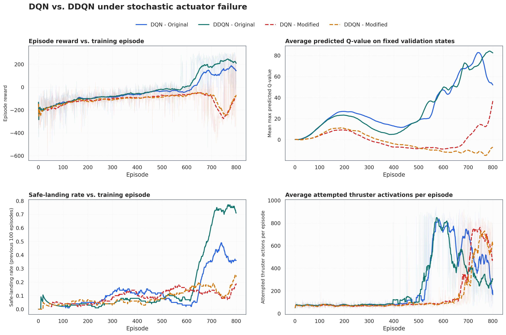

# The Flight Computer That Learned to Doubt Its Own Confidence

## A first-principles story about Q-learning, DQN, DDQN, and a lander with unreliable engines

At 02:17 mission time, a small lander named Aster-148 appeared over a grey
landing pad.

Its flight computer could issue four commands:

- do nothing;
- fire the left orientation engine;
- fire the main engine;
- fire the right orientation engine.

It could also read eight numbers: position, velocity, angle, angular velocity,
and whether each leg touched the ground.

That sounds like enough information to land. There was one problem: nobody had
written down the correct action for every possible situation.

The flight computer would have to learn.

## 1. Begin with the only thing the computer can observe: consequences

Imagine freezing the lander at one instant. The computer sees a state $s$,
chooses an action $a$, and the world returns:

- a new state $s'$;
- a reward $r$;
- a signal saying whether the episode ended.

The reward is not a complete instruction. It is a scoreboard. A good landing
may pay well, a crash may be expensive, and wasteful control may cost a little
at every step.

The computer's real goal is not to maximize the next reward. It is to maximize
the return:

$$
G_t = r_{t+1} + \gamma r_{t+2} + \gamma^2 r_{t+3} + \cdots
$$

The discount factor $\gamma$ says how much future consequences matter. A value
near one makes the computer care about the entire descent rather than a quick,
locally attractive move.

This distinction matters. Firing the main engine costs fuel now, but it may
prevent a crash later. Doing nothing is free now, but it may allow vertical
speed to become unrecoverable.

## 2. The flight computer invents a question

For every state and action, the computer would like to know:

> If I take this action now and behave well afterward, what return should I
> expect?

Call the answer $Q(s,a)$.

If the true values were known, control would be simple:

$$
\pi(s) = \arg\max_a Q(s,a)
$$

Choose the action with the highest expected return.

But the values are not known. The computer has to estimate them from experience.

## 3. A recursive clue: tomorrow's best value helps explain today's value

Suppose the computer selects action $a$ in state $s$, receives reward $r$, and
arrives in state $s'$. A sensible target for today's value is:

$$
y = r + \gamma \max_{a'} Q(s',a')
$$

The target says:

> Today's action is worth the reward it produced, plus the discounted value of
> the best action available tomorrow.

This is the Bellman idea. A long future is converted into a one-step update.

Tabular Q-learning moves the old estimate toward that target:

$$
Q(s,a) \leftarrow Q(s,a) + \alpha\left[y-Q(s,a)\right]
$$

The bracketed term is the temporal-difference error. It is the surprise between
what the computer predicted and what one transition now suggests.

## 4. Why the computer must sometimes ignore its own advice

Early estimates are almost meaningless. If the computer always chooses the
largest current value, a lucky first experience can trap it in a bad habit.

So Aster-148 uses an epsilon-greedy policy:

- with probability $\epsilon$, try a random action;
- otherwise, choose the action with the largest predicted Q-value.

Epsilon begins high, because ignorance should produce exploration. It decreases
with experience, because endless random control would prevent mastery.

Exploration is not noise added for decoration. It is how the computer obtains
evidence about actions it currently underrates.

## 5. The table becomes impossibly large

Tabular Q-learning works when states can be counted: square 17 in a grid, room 4
in a maze, cell 231 in a small game.

LunarLander states contain continuous numbers. A tiny change in horizontal
velocity produces a different state. There are far too many combinations for a
literal table.

The computer replaces the table with a neural network:

$$
Q(s,a;\theta)
$$

The network reads the eight state values and outputs four Q-values, one per
action. Similar states can now share statistical structure. Learning that a
main-engine pulse helps in one fast descent can influence predictions for a
nearby fast descent.

This is the "deep" in Deep Q-Network.

## 6. Why a plain neural network is not enough

Ordinary supervised learning assumes a stable dataset and stable labels.
DQN has neither.

The flight computer generates its own data while its policy changes. Consecutive
transitions are strongly related. Worse, the network's prediction is used to
construct the target that trains the same network.

It is like studying for an examination whose answer key is rewritten by the
student after every question.

DQN introduces two engineering controls.

### Experience replay: shuffle the memories

Each transition $(s,a,r,s',d)$ enters a replay buffer. Training samples random
mini-batches from this buffer.

Replay:

- breaks much of the short-range correlation between consecutive steps;
- reuses valuable experience more than once;
- mixes older and newer behavior.

### Target network: slow down the answer key

DQN keeps an online network for learning and a target network for constructing
bootstrap targets. The target network is updated less frequently.

Now the online network chases a target that pauses long enough to be learned.
Replay and the target network solve different problems; a strong implementation
needs both.

In this repository, those parts are visible in
[replay.py](../src/robust_lunarlander/replay.py) and
[agent.py](../src/robust_lunarlander/agent.py).

## 7. The optimism hidden inside a maximum

After many simulations, Aster-148 developed a dangerous habit. When uncertain,
it sometimes trusted whichever action happened to have the largest estimation
error.

Consider four gauges measuring the same uncertain quantity. Even if every gauge
is unbiased on average, selecting the largest reading favors a positive error.

DQN does something similar:

$$
y_{\text{DQN}} = r + \gamma \max_a Q_{\text{target}}(s',a)
$$

The target network both selects the largest action value and reports that value.
The maximum can therefore convert estimation noise into optimism.

High confidence is not automatically good. A confidently wrong lander is worse
than a cautious one.

## 8. Double DQN teaches the computer to ask a second opinion

Double DQN separates two jobs:

1. The online network selects the next action.
2. The target network evaluates that selected action.

$$
a^* = \arg\max_a Q_{\text{online}}(s',a)
$$

$$
y_{\text{DDQN}} =
r + \gamma Q_{\text{target}}(s',a^*)
$$

The same two networks already used by DQN are enough. The important change is
who performs selection and who performs evaluation.

Think of an engineer proposing a maneuver and a second engineer pricing the
risk. The proposal can still be wrong, but one noisy estimate no longer wins
and certifies itself in the same operation.

The single algorithm branch is implemented in
[agent.py](../src/robust_lunarlander/agent.py).

## 9. Then the main engine failed without telling the computer

The assignment makes Aster-148 more realistic. Whenever the computer selects a
thruster action, the command has a 15% chance of becoming "do nothing."

The computer is not told that replacement occurred.

This creates a hidden cause. From the learner's point of view, the same observed
state and selected action can lead to two different physical outcomes:

- the engine fires;
- the engine silently fails.

The transition target becomes more variable. A useful command can be followed
by a bad transition because the actuator failed. An unnecessary command can
occasionally appear harmless because it never executed.

This is a harder credit-assignment problem: which part of the outcome belongs
to the decision, and which part belongs to unobserved hardware randomness?

The wrapper is intentionally not allowed to add a failure flag. The learning
problem must remain partially ambiguous.

## 10. Why fuel cost follows intention, not execution

The modified reward is:

$$
R = R_{\text{base}} - 0.3\,\mathbf{1}(a \ne 0) + B
$$

The penalty depends on the action selected by the agent. A failed thruster
attempt still costs 0.3.

This prevents an accidental loophole. If failed commands were free, the agent
might learn to spam thrusters and let actuator randomness erase some costs.
Charging the attempt asks the policy to be selective about issuing commands,
not merely lucky about which commands execute.

## 11. The landing bonus is a logical AND, not a vague feeling

The extra bonus is 50 only when all conditions hold:

- the episode terminated;
- it was not truncated;
- both legs touch the pad;
- absolute horizontal velocity is below 0.10;
- absolute vertical velocity is below 0.10;
- absolute angle is below 0.10 radians.

One failed condition means no bonus.

This is important engineering practice. "Safe landing" becomes a testable
contract rather than a subjective label. Boundary tests check that equality at
0.10 fails because the requirement says strictly less than 0.10.

See [envs.py](../src/robust_lunarlander/envs.py) for the contract and
[verification.py](../src/robust_lunarlander/verification.py) for its external
statistical and controlled tests.

## 12. Four experiments, one fair question

The study trains:

1. DQN on the original environment.
2. DDQN on the original environment.
3. DQN on the modified environment.
4. DDQN on the modified environment.

A fair comparison keeps architecture, optimizer, replay buffer, exploration,
seed, and duration identical. Otherwise an apparent algorithm advantage might
really be a hyperparameter advantage.

The study also collects one fixed set of validation states before training. At
every episode, each agent predicts Q-values for those same states.

Why fixed states? If the measurement states changed each episode, a rising curve
could mean either "the network predicts larger values" or "today's states are
easier." A fixed set removes that ambiguity.

## 13. What the results say

The plots tell a coherent but not simplistic story:

- DDQN performs better than DQN in greedy evaluation under hidden failures.
- The DQN-DDQN Q-value gap is much larger in the modified environment.
- Hidden failures reduce strict landing reliability.
- The fuel penalty can encourage efficient control in a successfully learned
  policy, but it cannot rescue a policy whose learning collapses.

The last point matters. Reward design creates incentives; it does not guarantee
that a finite neural-network training run discovers the desired behavior.

## 14. The final lesson

Aster-148 did not become robust merely by adding more layers.

It became more trustworthy because the experiment separated ideas:

- Q-learning supplied the recursive control objective.
- A neural network generalized across continuous states.
- Replay memory broke short-range correlation.
- A target network slowed the moving target.
- Epsilon-greedy exploration collected missing evidence.
- Double DQN separated selection from evaluation.
- Exact wrapper tests proved what the environment actually did.
- Fixed validation states made value estimates comparable.
- Multiple behavioral metrics prevented reward alone from telling the story.

And the flight computer learned one last principle:

> Intelligence is not only choosing the action with the highest number.
> Sometimes it is knowing why the number may be too high.

## Continue learning

Use the ordered [Reading and Watch List](reading_list.md) for the papers,
lectures, courses, official tutorials, and follow-up experiments that deepen
each idea in this story.
