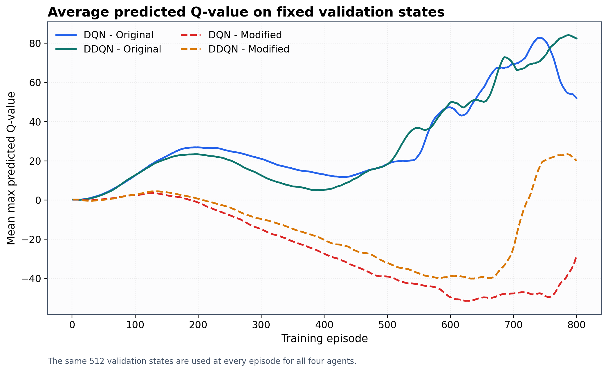

# Reading and Watch List: Q-Learning to Robust DDQN

This is a focused path for understanding the ideas used in this repository.
It is ordered so that every resource answers a question raised by the previous
one. You do not need to consume everything before reading the code.

## The 90-minute minimum path

1. Read the original story in
   [The Flight Computer That Learned to Doubt Its Own Confidence](first_principles_story.md).
   It develops the complete assignment from first principles without assuming
   prior reinforcement-learning knowledge.
2. Watch
   [David Silver, Lecture 5: Model-Free Control](https://www.youtube.com/playlist?list=PLzuuYNsE1EZAXYR4FJ75jcJseBmo4KQ9-).
   Focus on epsilon-greedy control and off-policy Q-learning.
3. Work through the official
   [PyTorch DQN tutorial](https://docs.pytorch.org/tutorials/intermediate/reinforcement_q_learning.html).
   Map its policy network, replay memory, target network, and optimization step
   to this repository.
4. Read the Double-DQN paper's abstract, method, and plots:
   [Deep Reinforcement Learning with Double Q-Learning](https://doi.org/10.1609/aaai.v30i1.10295).

## Stage 1 - Build the mental model

### Book

- [Reinforcement Learning: An Introduction, second edition](http://incompleteideas.net/book/the-book-2nd.html)
  by Richard Sutton and Andrew Barto. Read Chapter 3 for the agent-environment
  loop and Chapter 6 for temporal-difference learning, SARSA, and Q-learning.
  This is the best foundation for understanding why the Bellman target works.

### Video course

- [David Silver's Reinforcement Learning course](https://www.youtube.com/playlist?list=PLzuuYNsE1EZAXYR4FJ75jcJseBmo4KQ9-).
  Recommended order for this project:

  - Lecture 1: agent, environment, state, action, reward, return.
  - Lecture 4: temporal-difference prediction.
  - Lecture 5: model-free control and Q-learning.
  - Lecture 6: value-function approximation.
  - Lecture 9: exploration versus exploitation.

### Free interactive course

- [Hugging Face Deep Reinforcement Learning Course](https://huggingface.co/learn/deep-rl-course/en/unit0/introduction).
  Use Unit 2 for tabular Q-learning and Unit 3 for the transition from a Q-table
  to a Deep Q-Network. The course includes hands-on notebooks.

## Stage 2 - Understand DQN as an engineered system

### Paper

- [Human-level control through deep reinforcement learning](https://doi.org/10.1038/nature14236)
  by Mnih et al. Study the experience-replay and target-network ideas. These are
  not decorations: replay reduces short-range correlation, while the target
  network slows down the target that the online network is chasing.

### Official implementation tutorial

- [Reinforcement Learning (DQN) Tutorial - PyTorch](https://docs.pytorch.org/tutorials/intermediate/reinforcement_q_learning.html).
  Compare its architecture and replay loop with
  [network.py](../src/robust_lunarlander/network.py),
  [replay.py](../src/robust_lunarlander/replay.py), and
  [agent.py](../src/robust_lunarlander/agent.py).

### Deep-dive video

- [DeepMind x UCL Lecture 12: Deep Reinforcement Learning](https://www.youtube.com/watch?v=cVzvNZOBaJ4&list=PLqYmG7hTraZDVH599EItlEWsUOsJbAodm&index=12).
  This lecture explains why consecutive samples, moving targets, and function
  approximation make deep RL unstable, then motivates practical controls.

## Stage 3 - Understand why Double DQN exists

### Primary paper

- [Deep Reinforcement Learning with Double Q-Learning](https://doi.org/10.1609/aaai.v30i1.10295)
  by van Hasselt, Guez, and Silver. The key idea is small but important:
  the online network selects the next action, and the target network evaluates
  that selected action.

### What to look for in this repository

Open [agent.py](../src/robust_lunarlander/agent.py) and find the bootstrap-value
calculation. The DQN and DDQN experiments share every component except this
target operation. Then inspect the fixed-state Q-value plot:

Ask:

- When do the DQN and DDQN estimates begin to separate?
- Is the gap larger under hidden action failure?
- Does the algorithm with the larger Q-value always earn the larger return?

## Stage 4 - Connect theory to LunarLander

- [Official Gymnasium LunarLander-v3 documentation](https://gymnasium.farama.org/environments/box2d/lunar_lander/)
  explains the eight observation values, four discrete actions, reward system,
  termination, and truncation.
- [Environment wrapper](../src/robust_lunarlander/envs.py) implements the hidden
  15% thruster failure, selected-action fuel penalty, and strict safe-landing
  bonus.
- [Verification design](../src/robust_lunarlander/verification.py) shows how to
  observe executed actions externally without leaking failure information to
  the learning agent.
- [Four-metric experiment overview](../artifacts/plots/four_metric_overview.png)
  connects reward, predicted values, strict landing success, and control effort.

## Stage 5 - Go beyond this assignment

### Classic Q-learning paper

- [Q-learning](https://doi.org/10.1007/BF00992698) by Watkins and Dayan.
  Read this after Chapter 6 of Sutton and Barto if you want the convergence
  argument behind tabular off-policy control.

### Curated resource index

- [Awesome Reinforcement Learning](https://github.com/aikorea/awesome-rl)
  is a broad index of lectures, books, papers, environments, libraries, and
  implementations. Use it as a map, not a linear syllabus.

### Recommended experiments

1. Repeat the 2 x 2 study over 10 paired seeds and add confidence intervals.
2. Sweep failure probability over 0%, 5%, 15%, and 30%.
3. Separate selected thrusters from successfully executed thrusters in an
   evaluator-only diagnostic.
4. Add a penalty ablation: failure only, penalty only, both, and neither.
5. Compare hard target copies with Polyak averaging while keeping all other
   settings fixed.

## A checklist for genuine understanding

You understand this project when you can explain, without reading the code:

- why a Q-value is not the same as immediate reward;
- why epsilon-greedy exploration is needed even when a greedy action exists;
- why replay memory and a target network address different stability problems;
- why a maximum over noisy estimates tends to be optimistic;
- how DDQN separates selection from evaluation;
- why an invisible actuator failure increases target variance;
- why the fuel penalty follows the selected action rather than executed action;
- why a fixed validation-state set makes Q-value curves comparable; and
- why one seed supports a reproducible example but not a population claim.
